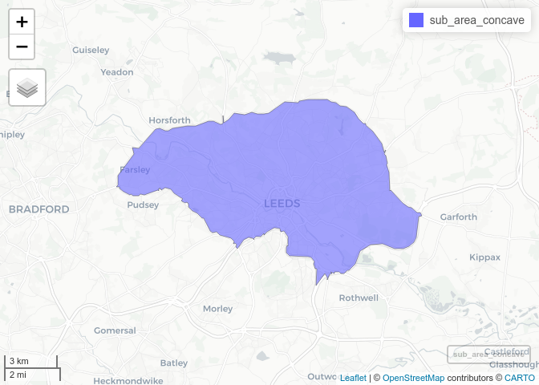
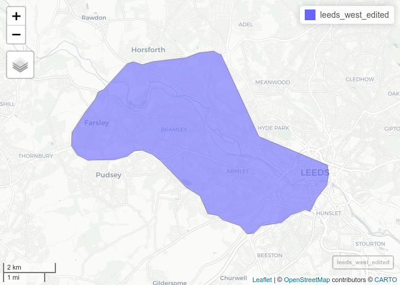

<!-- README.md is generated from README.Rmd. Please edit that file -->

# leedsboundaries

<!-- badges: start -->
<!-- badges: end -->

The goal of leedsboundaries is to show different ways of defining the
geographic extent of ‘Leeds’ in a reproducible way. Leeds is a city and
local authority in the North of England, North of Sheffield, South of
Newcastle, East of Manchester and West of Hull.

<!-- To reproduce this document you must have a recent version of R and the following packages loaded: -->

It is most easily defined by its local authority boundaries, which are
as follows:

<!-- -->

For the purposes of transport planning and other applications, other
definitions are useful.

One way of defining Leeds is everything in ring roads. This looks
roughly as follows:

<!-- -->

A neater boundary can be obtained by taking the ‘concave hull’ of major
roads in the rough outline shown above:

<!-- -->

<!-- -->

A simplified version of the previous polygon is as follows:

<!-- -->

The resulting file is saved as `sub_area_simple.geojson` in this repo.

There are various ways to break-up cities into divisions, which can be
useful for visualisation or increasing responsiveness in software such
as abstreet. There are many ways to divide-up cities, the simplest being
to use existing boundaries, that we will try in this case:

<!-- -->

Let’s filter-out those based near Leeds:

<!-- -->

There are 5 main areas that have a substantial chunk in Leeds:

    #> Warning in st_buffer.sfc(st_geometry(x), dist, nQuadSegs, endCapStyle =
    #> endCapStyle, : st_buffer does not correctly buffer longitude/latitude data
    #> Warning: attribute variables are assumed to be spatially constant throughout all
    #> geometries

<!-- -->

    #> [1] "Leeds Central"    "Leeds East"       "Leeds North East" "Leeds North West"
    #> [5] "Leeds West"

I’ll edit them manually, combining Leeds North East and Leeds North
West:

<!-- --><!-- --><!-- -->

Alltogether, these are:

<!-- -->
